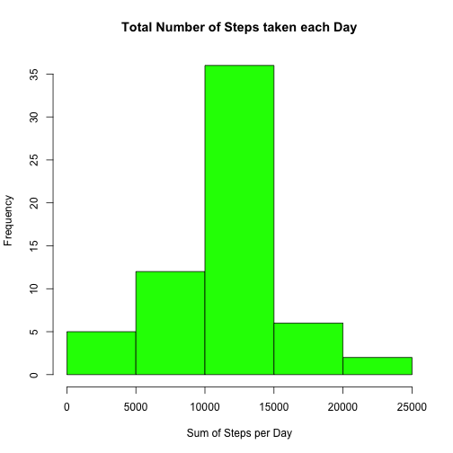

Reproducible Research PA1
=========================

Please set your working directory so that it includes the activity.csv data

## Reading and Processing the Data

```r
#Loading and processing Data
activity <- read.csv("activity.csv")
activity$date <- as.Date(activity$date, format = "%Y-%m-%d")

#Create a dataframe with no NA values called activity1
activity1 <- activity[complete.cases(activity),]
row.names(activity1) <- NULL 
```

Our data has the following structure:

```r
str(activity1)
```

```
## 'data.frame':	15264 obs. of  3 variables:
##  $ steps   : int  0 0 0 0 0 0 0 0 0 0 ...
##  $ date    : Date, format: "2012-10-02" "2012-10-02" ...
##  $ interval: int  0 5 10 15 20 25 30 35 40 45 ...
```

## What is mean total number of steps taken per day?

First we aggregate the number of steps in each day

```r
agg <- aggregate(activity1$steps, by = list(activity1$date), sum)
colnames(agg) <- c("date","steps")
```

### Make a histogram of the total number of steps taken each day

```r
hist(agg$steps, xlab = "Sum of Steps per Day", main = "Total Number of Steps taken each Day", col = "red")
```

 

### Calculate and report the mean and median total number of steps taken per day

```r
mean(agg$steps, na.rm = T) 
```

```
## [1] 10766
```

```r
median(agg$steps, na.rm = T) 
```

```
## [1] 10765
```

## What is the average daily activity pattern?

First I sort by interval and create a data frame of the 5-minute interval  and the average number of steps taken, averaged across all days


```r
activity1$interval <- sort(activity1$interval)
aggStep = aggregate(steps ~ interval, data=activity, FUN=mean)
```

Then I make the relevant plot

```r
plot(aggStep, type = "l", main = "Mean number of steps by interval")
```

 

### Which 5-minute interval, on average across all the days in the dataset, contains the maximum number of steps?
The maximum step taken is

```r
maxstep<- max(aggStep$steps,na.rm=T) 
maxstep
```

```
## [1] 206.2
```
which belongs to this interval

```r
aggStep$interval[which(aggStep$step == maxstep)] 
```

```
## [1] 835
```

## Imputting the Missing Values

Calculate and report the total number of missing values in the dataset (i.e. the total number of rows with NAs)

```r
sum(is.na(activity))
```

```
## [1] 2304
```
### Devise a strategy for filling in all of the missing values in the dataset. The strategy does not need to be sophisticated. For example, you could use the mean/median for that day, or the mean for that 5-minute interval, etc.


```r
noNactivity <- activity
noNactivity$completeSteps <- noNactivity$steps # Creating column for the imputed values
```

Imputing the missing values by using the mean of the 5-minute interval

```r
for (i in 1 : length(noNactivity[,4])){   
                if (is.na(noNactivity$completeSteps[i])){
                                noNactivity$completeSteps[i] <- aggStep$steps[which(aggStep$interval == noNactivity$interval[i])]                                               
        }
}
```

### Create a new dataset that is equal to the original dataset but with the missing data filled in.

```r
completeActivity <- activity
completeActivity$steps <- noNactivity$completeSteps
```

### Make a histogram of the total number of steps taken each day and Calculate and report the mean and median total number of steps taken per day. Do these values differ from the estimates from the first part of the assignment? What is the impact of imputing missing data on the estimates of the total daily number of steps?


```r
completeAgg<- aggregate(completeActivity$steps, by = list(completeActivity$date), sum)
colnames(completeAgg) <- c("date","steps")
```
### Histogram

```r
hist(completeAgg$steps, xlab = "Sum of Steps per Day", main = "Total Number of Steps taken each Day", col = "green")
```

 

### Calculate and report the mean and median total number of steps taken per day for completeAgg

```r
mean(completeAgg$steps, na.rm = T) #mean
```

```
## [1] 10766
```

```r
median(completeAgg$steps, na.rm = T) #median
```

```
## [1] 10766
```

The impact is mainly that the mean approaches the median

### Create a column indicating the day of the week


```r
completeActivity$day <- weekdays(completeActivity$date)
completeActivity$day[which(completeActivity$day != "Saturday" &  completeActivity$day != "Sunday")] <- "Weekday" 
completeActivity$day[which(completeActivity$day == "Saturday" |  completeActivity$day == "Sunday")] <- "Weekend" 
completeActivity$day <- as.factor(completeActivity$day)
```

## Create a a panel plot containing a time series plot (i.e. type = "l") of the 5-minute interval (x-axis) and the average number of steps taken, averaged across all weekday days or weekend days (y-axis)

First I aggregate the data


```r
aggdat = aggregate(completeActivity$steps ~ completeActivity$interval+completeActivity$day, data=completeActivity, FUN=mean)
colnames(aggdat) <- c("interval","day","steps")
```

And then I constract the plot with the lattice package


```r
library(lattice)
xyplot(steps ~ interval| day, 
       data = aggdat,
       type = "l",
       main="Number of steps per period",
       xlab="Period", 
       layout=c(1,2)
)
```

 

knit2html("PA1_template.Rmd")
 
 


